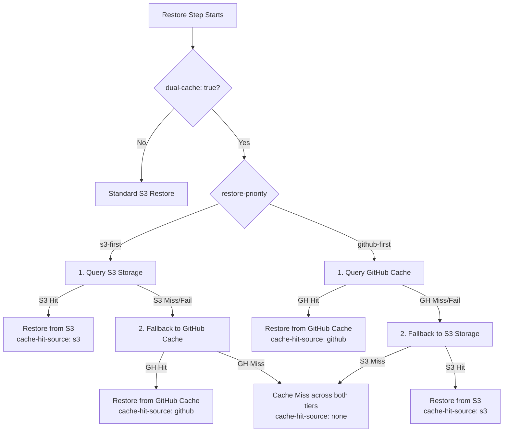

# Dual Caching (S3 + GitHub Actions Cache)

**Dual Caching** allows your GitHub Actions workflows to save and restore cache bundles across **both** remote S3-compatible storage and GitHub's native Actions Cache service simultaneously.

---

## Why Dual Caching?

In modern CI/CD setups, organizations often run a hybrid infrastructure:
- Standard linting, light tests, and PR checks run on **GitHub-hosted runners** (`ubuntu-latest`).
- Heavy compilation, Docker builds, GPU workloads, and integration tests run on **self-hosted runners** (Kubernetes, AWS EC2, or on-premise bare-metal).

This creates a common challenge:
1. **Runner Isolation**: Self-hosted or remote runners may have high latency, bandwidth limits, or restricted access to GitHub's internal cache service, but have direct, high-speed access to an S3-compatible bucket (or local Garage / SeaweedFS / MinIO / Cloudflare R2).
2. **Quota Limits**: GitHub enforces a strict **10 GB per repository** cache limit. Once exceeded, older caches are evicted, causing unexpected slowdowns.
3. **Redundancy & Availability**: If GitHub's cache service experiences transient 503 errors or an outage, having S3 as an active peer ensures your builds never suffer cold starts.

With Dual Caching enabled, the **exact same cache keys** are populated in both systems, and jobs can seamlessly read from whichever source is optimal.

---

## Architecture & Flow

### Restore Flow



### Save Flow (Post-step)

When `dual-cache: true` is enabled, the post-run step evaluates both tiers according to `dual-cache-strategy`:

| Strategy | Behavior |
|---|---|
| **`backfill`** *(default)* | If one tier hit but the other missed (e.g. GitHub Cache hit, S3 missed), post-save automatically **backfills** the missing tier so both systems stay synchronized. |
| **`independent`** | Verifies existence in S3 and GitHub independently, uploading to any tier where the key is absent. |
| **`skip-on-hit`** | If an exact match hit occurred on *either* tier during restore, saving is skipped on both. |

---

## Real-World Use Cases & Examples

### Use Case 1: Hybrid Runner Fleet (GitHub-Hosted + Self-Hosted)

A single workflow where Job A runs on GitHub-hosted runners and Job B runs on self-hosted GPU runners, sharing the same cache:

```yaml
name: Hybrid Fleet CI

on: [push, pull_request]

jobs:
  # Job A: Runs on GitHub-hosted runner, prefers GitHub Cache
  lint-and-unit-tests:
    runs-on: ubuntu-latest
    steps:
      - uses: actions/checkout@v4

      - name: Cache dependencies (Dual Mode - GitHub Preferred)
        uses: xSAVIKx/cloud-cache-action@v1
        with:
          bucket: my-ci-cache-bucket
          endpoint: https://${{ secrets.R2_ACCOUNT_ID }}.r2.cloudflarestorage.com
          access-key: ${{ secrets.R2_ACCESS_KEY }}
          secret-key: ${{ secrets.R2_SECRET_KEY }}
          dual-cache: true
          restore-priority: github-first # Fast local GitHub cache on hosted runner
          key: ${{ runner.os }}-node-${{ hashFiles('**/package-lock.json') }}
          path: ~/.npm

      - run: npm ci
      - run: npm test

  # Job B: Runs on self-hosted runner, prefers S3 / R2
  heavy-integration-tests:
    needs: lint-and-unit-tests
    runs-on: [self-hosted, linux, x64]
    steps:
      - uses: actions/checkout@v4

      - name: Cache dependencies (Dual Mode - S3 Preferred)
        uses: xSAVIKx/cloud-cache-action@v1
        with:
          bucket: my-ci-cache-bucket
          endpoint: https://${{ secrets.R2_ACCOUNT_ID }}.r2.cloudflarestorage.com
          access-key: ${{ secrets.R2_ACCESS_KEY }}
          secret-key: ${{ secrets.R2_SECRET_KEY }}
          dual-cache: true
          restore-priority: s3-first # Direct high-speed connection to R2/S3
          key: ${{ runner.os }}-node-${{ hashFiles('**/package-lock.json') }}
          path: ~/.npm

      - run: npm ci
      - run: npm run test:integration
```

---

### Use Case 2: Quota Spillover & High-Availability Redundancy

Avoid cold builds when GitHub's 10GB per-repo cache limit evicts keys, or during GitHub service disruptions:

```yaml
- name: Cache with S3 backup
  id: cache-step
  uses: xSAVIKx/cloud-cache-action@v1
  with:
    bucket: my-overflow-s3-bucket
    access-key: ${{ secrets.AWS_ACCESS_KEY_ID }}
    secret-key: ${{ secrets.AWS_SECRET_ACCESS_KEY }}
    dual-cache: true
    restore-priority: github-first # Use GitHub cache while available
    dual-cache-strategy: backfill  # Keep S3 continuously primed as cold-cache safety net
    key: ${{ runner.os }}-gradle-${{ hashFiles('**/*.gradle*') }}
    restore-keys: |
      ${{ runner.os }}-gradle-
    path: ~/.gradle/caches

- name: Inspect Cache Hit Source
  run: |
    echo "Cache Hit: ${{ steps.cache-step.outputs.cache-hit }}"
    echo "Serviced by: ${{ steps.cache-step.outputs.cache-hit-source }}" # 'github', 's3', or 'none'
```

---

### Use Case 3: Zero-Downtime Migration from GitHub Cache to Cloud Storage

If your team is migrating from `actions/cache` to Cloudflare R2 or AWS S3:
1. Enable `dual-cache: true` with `restore-priority: github-first`.
2. Existing builds will continue restoring instantly from GitHub Actions Cache.
3. In the background, `backfill` saves every cache bundle to your S3 bucket.
4. Once your S3 bucket is warmed up, switch `restore-priority: s3-first` or turn off dual-cache.

---

## Dual-Cache Configuration Reference

### Inputs

| Input | Type | Default | Description |
|---|:---:|:---:|---|
| `dual-cache` | boolean | `false` | Enables simultaneous caching across S3-compatible storage and GitHub Actions Cache. |
| `restore-priority` | string | `s3-first` | Order to check caches during restore: `s3-first` or `github-first`. |
| `dual-cache-strategy` | string | `backfill` | Save synchronization mode: `backfill` (sync missing tier), `independent`, or `skip-on-hit`. |
| `dual-cache-strict` | boolean | `false` | When `false` (default), errors in one tier emit warnings without failing the job. When `true`, any failure halts execution. |

### Outputs

| Output | Values | Description |
|---|:---:|---|
| `cache-hit-source` | `s3` \| `github` \| `none` | Identifies which storage tier provided the restored cache bundle. |
| `cache-saved-sources` | `s3,github` \| `s3` \| `github` \| `none` | Comma-separated list of storage tiers that successfully stored the cache bundle. |
