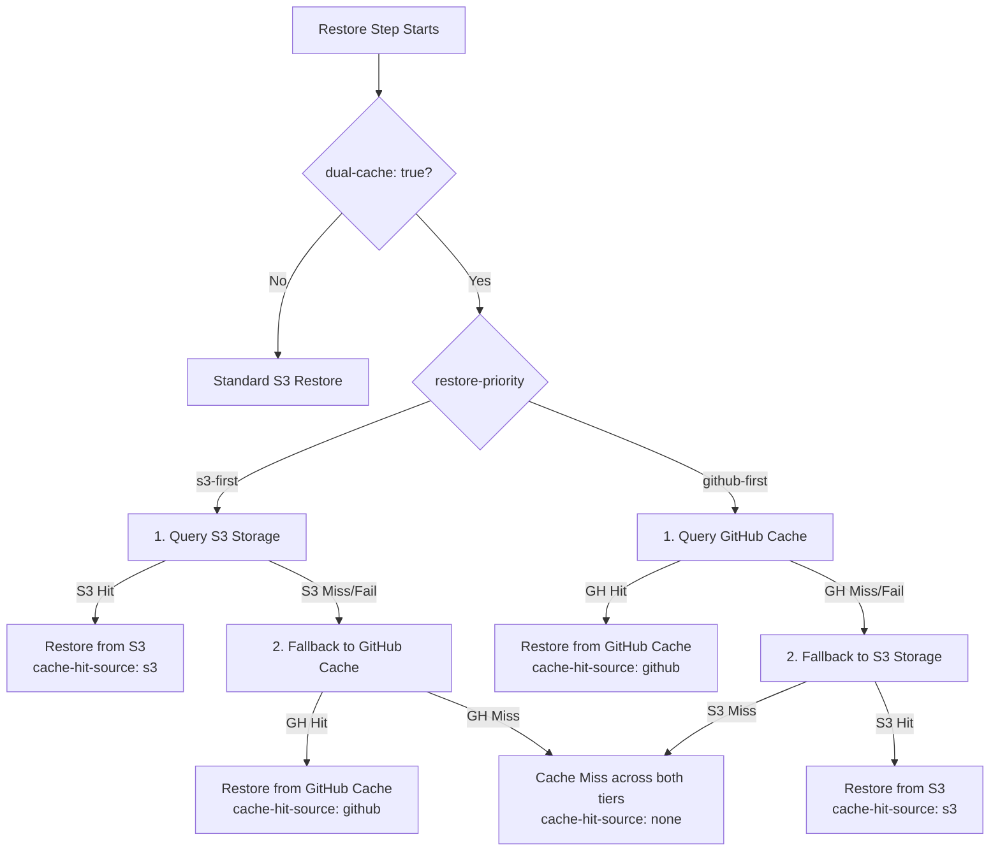

# Dual Caching (S3 + GitHub Actions Cache)

**Dual Caching** allows your GitHub Actions workflows to save and restore cache bundles across **both** remote S3-compatible storage and GitHub's native Actions Cache service simultaneously.

---

## Why Dual Caching?

In modern CI/CD setups, organizations often run a hybrid infrastructure:

- Standard linting, light tests, and PR checks run on **GitHub-hosted runners** (`ubuntu-latest`).
- Heavy compilation, Docker builds, GPU workloads, and integration tests run on **self-hosted runners** (Kubernetes, AWS EC2, or on-premise bare-metal).

This creates a common challenge:

1. **Runner Isolation**: Self-hosted or remote runners may have high latency, bandwidth limits, or restricted access to GitHub's internal cache service, but have direct, high-speed access to an S3-compatible bucket (or local Garage / SeaweedFS / MinIO / Cloudflare R2).
2. **Quota Limits**: GitHub enforces a strict **10 GB per repository** cache limit. Once exceeded, older caches are evicted, causing unexpected slowdowns.
3. **Redundancy & Availability**: If GitHub's cache service experiences transient 503 errors or an outage, having S3 as an active peer ensures your builds never suffer cold starts.

With Dual Caching enabled, the **exact same cache keys** are populated in both systems, and jobs can seamlessly read from whichever source is optimal.

---

## Architecture & Flow

### Restore Flow



### Save Flow (Post-step)

When `dual-cache: true` is enabled, the post-run step evaluates both tiers according to `dual-cache-strategy`:

| Strategy                   | Behavior                                                                                                                                                           |
| -------------------------- | ------------------------------------------------------------------------------------------------------------------------------------------------------------------ |
| **`backfill`** _(default)_ | If one tier hit but the other missed (e.g. GitHub Cache hit, S3 missed), post-save automatically **backfills** the missing tier so both systems stay synchronized. |
| **`independent`**          | Verifies existence in S3 and GitHub independently, uploading to any tier where the key is absent.                                                                  |
| **`skip-on-hit`**          | If an exact match hit occurred on _either_ tier during restore, saving is skipped on both.                                                                         |

---

## Real-World Use Cases & Examples

### Use Case 1: Lightweight Runners for Dependencies $\to$ Remote Cloud VM for Heavy Builds

A common architectural pattern is separating concerns across runner tiers to minimize cloud compute costs:

1. **Lightweight GitHub-hosted runner (`ubuntu-latest`)**: Runs quick tasks like `npm ci` to assemble `node_modules` or download package dependencies.
2. **Heavyweight Remote Cloud runner (`[self-hosted, aws-heavy]`)**: An EC2 or GCP machine with high CPU/GPU/RAM dedicated to compiling native artifacts, building Docker images, or executing end-to-end integration tests.

With **Dual Caching**:

- The GitHub-hosted runner uses `dual-cache: true` with `restore-priority: github-first` and `dual-cache-strategy: backfill`. It benefits from GitHub's internal runner cache, but **automatically synchronizes the populated `node_modules` directly into your AWS S3 or GCP bucket**.
- The remote cloud machine then restores `node_modules` directly from S3 at line-rate internal VPC speeds (`restore-priority: s3-first`) without network bottlenecking or GitHub cache quota contention.

```yaml
name: Full Pipeline (Lightweight Prep to Heavy Cloud Build)

on: [push, pull_request]

jobs:
  # Job 1: Lightweight GitHub-hosted runner resolves dependencies
  prepare-dependencies:
    runs-on: ubuntu-latest
    steps:
      - uses: actions/checkout@3d3c42e5aac5ba805825da76410c181273ba90b1 # v7.0.1

      - name: Cache node_modules (Dual Mode: GitHub + S3 Sync)
        id: cache-deps
        uses: xSAVIKx/cloud-cache-action@v1
        with:
          bucket: my-company-ci-cache
          endpoint: https://s3.us-east-1.amazonaws.com # or GCS / Cloudflare R2
          access-key: ${{ secrets.AWS_ACCESS_KEY_ID }}
          secret-key: ${{ secrets.AWS_SECRET_ACCESS_KEY }}
          dual-cache: true
          restore-priority: github-first # Quickest on GitHub-hosted runner
          dual-cache-strategy: backfill  # Ensures S3 gets populated even if GitHub Cache hit
          key: ${{ runner.os }}-node-modules-${{ hashFiles('**/package-lock.json') }}
          path: node_modules

      - name: Install dependencies on miss
        if: steps.cache-deps.outputs.cache-hit != 'true'
        run: npm ci

  # Job 2: Heavyweight remote AWS/GCP runner builds Docker / Native binaries
  build-product:
    needs: prepare-dependencies
    runs-on: [self-hosted, aws-c6i-metal] # Heavy remote VM located inside AWS VPC
    steps:
      - uses: actions/checkout@3d3c42e5aac5ba805825da76410c181273ba90b1 # v7.0.1

      # Instantly pulls node_modules directly from local AWS S3 bucket over internal VPC
      - name: Restore node_modules from S3
        uses: xSAVIKx/cloud-cache-action@v1
        with:
          bucket: my-company-ci-cache
          endpoint: https://s3.us-east-1.amazonaws.com
          access-key: ${{ secrets.AWS_ACCESS_KEY_ID }}
          secret-key: ${{ secrets.AWS_SECRET_ACCESS_KEY }}
          dual-cache: true
          restore-priority: s3-first    # Direct VPC speed, no GitHub egress lag
          read-only: true               # Dependencies were already saved by Job 1
          key: Linux-node-modules-${{ hashFiles('**/package-lock.json') }}
          path: node_modules

      # Docker layer cache can also be persisted to S3
      - name: Cache Docker Buildx layers
        uses: xSAVIKx/cloud-cache-action@v1
        with:
          bucket: my-company-ci-cache
          access-key: ${{ secrets.AWS_ACCESS_KEY_ID }}
          secret-key: ${{ secrets.AWS_SECRET_ACCESS_KEY }}
          key: docker-layers-${{ github.sha }}
          restore-keys: |
            docker-layers-
          path: /tmp/.buildx-cache

      - name: Build Native / Docker Product
        run: |
          docker buildx build \
            --cache-from=type=local,src=/tmp/.buildx-cache \
            --cache-to=type=local,dest=/tmp/.buildx-cache-new,mode=max \
            -t my-app:latest .
```

---

### Use Case 2: Quota Spillover & High-Availability Redundancy

Avoid cold builds when GitHub's 10GB per-repo cache limit evicts keys, or during GitHub service disruptions:

```yaml
- name: Cache with S3 backup
  id: cache-step
  uses: xSAVIKx/cloud-cache-action@v1
  with:
    bucket: my-overflow-s3-bucket
    access-key: ${{ secrets.AWS_ACCESS_KEY_ID }}
    secret-key: ${{ secrets.AWS_SECRET_ACCESS_KEY }}
    dual-cache: true
    restore-priority: github-first # Use GitHub cache while available
    dual-cache-strategy: backfill # Keep S3 continuously primed as cold-cache safety net
    key: ${{ runner.os }}-gradle-${{ hashFiles('**/*.gradle*') }}
    restore-keys: |
      ${{ runner.os }}-gradle-
    path: ~/.gradle/caches

- name: Inspect Cache Hit Source
  run: |
    echo "Cache Hit: ${{ steps.cache-step.outputs.cache-hit }}"
    echo "Serviced by: ${{ steps.cache-step.outputs.cache-hit-source }}" # 'github', 's3', or 'none'
```

---

### Use Case 3: Zero-Downtime Migration from GitHub Cache to Cloud Storage

If your team is migrating from `actions/cache` to Cloudflare R2 or AWS S3:

1. Enable `dual-cache: true` with `restore-priority: github-first`.
2. Existing builds will continue restoring instantly from GitHub Actions Cache.
3. In the background, `backfill` saves every cache bundle to your S3 bucket.
4. Once your S3 bucket is warmed up, switch `restore-priority: s3-first` or turn off dual-cache.

---

## Dual-Cache Configuration Reference

### Inputs

| Input                 |  Type   |  Default   | Description                                                                                                                 |
| --------------------- | :-----: | :--------: | --------------------------------------------------------------------------------------------------------------------------- |
| `dual-cache`          | boolean |  `false`   | Enables simultaneous caching across S3-compatible storage and GitHub Actions Cache.                                         |
| `restore-priority`    | string  | `s3-first` | Order to check caches during restore: `s3-first` or `github-first`.                                                         |
| `dual-cache-strategy` | string  | `backfill` | Save synchronization mode: `backfill` (sync missing tier), `independent`, or `skip-on-hit`.                                 |
| `dual-cache-strict`   | boolean |  `false`   | When `false` (default), errors in one tier emit warnings without failing the job. When `true`, any failure halts execution. |

### Outputs

| Output                |                  Values                   | Description                                                                      |
| --------------------- | :---------------------------------------: | -------------------------------------------------------------------------------- |
| `cache-hit-source`    |        `s3` \| `github` \| `none`         | Identifies which storage tier provided the restored cache bundle.                |
| `cache-saved-sources` | `s3,github` \| `s3` \| `github` \| `none` | Comma-separated list of storage tiers that successfully stored the cache bundle. |

---

## Live CI Dogfooding & Verification

The dual-cache backfill and skip-on-hit strategies are exercised continuously within the repository's test workflow: [`.github/workflows/test.yml`](https://github.com/xSAVIKx/cloud-cache-action/blob/main/.github/workflows/test.yml).

::: details `.github/workflows/test.yml` (Click to view full CI test workflow)
<<< ../../.github/workflows/test.yml{yaml}
:::

